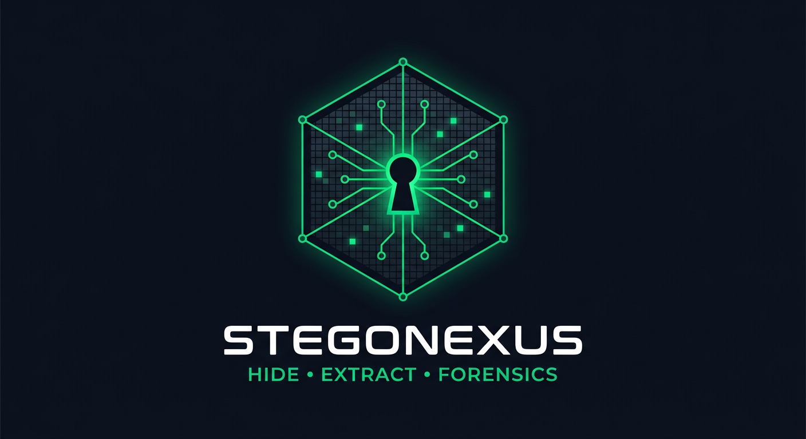

# StegoNexus — Unified Hiding, Extraction & Forensics Framework

<p align="center"></p>

**Prepared & Developed by: Mohammed Moneer Al-absi**

> تحويل تقنيات الإخفاء (Hiding) والاستخراج (Extraction) التي تم تناولها خلال الترم
> إلى **أداة واحدة متكاملة** تعمل على Kali Linux، توفر **Dashboard موحّدة** للاختيار
> بين أنواع الإخفاء أو الانتقال إلى قسم **Forensics / Analysis** لفحص الملفات
> والبحث عن مؤشرات وبيانات مخفية — مع ربط كل النتائج بملف **Case** وقابلية حفظها
> ضمن **Reports** و **Logs**.

---

## 📦 Sections implemented (12/12 from the project sheet)

| # | Section | Status | Implementation |
|---|---------|--------|----------------|
| 01 | General Overview + unified Dashboard | ✅ | PySide6 GUI (left-nav + stacked pages) |
| 02 | Forensics & Analysis | ✅ | `file`, `strings`, `exiftool`, `binwalk`, `steghide info`, `foremost`, `zsteg`, **Shannon Entropy** — aggregated in one report, tied to the Case |
| 03 | Hashing & Integrity | ✅ | MD5, SHA-1, SHA-256, SHA-512 (+ file compare, manifests) |
| 04 | Text Hiding — LSB with Key | ✅ | Cover + Secret + Key → LSB → Stego Text; Key → decode |
| 05 | Image Hiding | ✅ | **Steghide** wrapper + **CyberHide**-style AES-256-CBC + HMAC LSB (pure-Python fallback) |
| 06 | Audio Hiding | ✅ | **LSB**, **Phase Coding**, **Spread Spectrum**, **Metadata** (RIFF-INFO), Audacity-style **Spectrogram** / **Waveform** |
| 07 | Video Hiding | ✅ | **videohide.sh** (generated), **FFprobe** streams, **FFmpeg**, Video **LSB**, Spread Spectrum, Container/File Hiding |
| 08 | Network Hiding — Covert Communication | ✅ | Sender/Receiver, IP-ID LSB, TCP-ISN LSB, **timing** channels, PCAP record + detection heuristics |
| 09 | Malware Hiding & Evasion | ✅ | PyInstaller / WinRAR / Sliver / Metasploit indicator scan, PE & ELF section entropy, overlay detection, inert demo stub (defence exercise) |
| 10 | Tools & Techniques matrix | ✅ | every module exposes `status()` / tool detection |
| 11 | Case Management | ✅ | Cases, Reports Generation (MD/JSON/HTML), Investigation Logs |
| 12 | Conclusion | ✅ | one framework covering Text+Image+Audio+Video+Network (+Malware) + Hashing + Forensics |

---

## 🗂 Project layout

```
StegoNexus/
├── run_gui.py                     # Launch the Dashboard (GUI)
├── run_cli.py                     # Launch the command-line toolkit
├── stegonexus/
│   ├── cli.py                     # argparse CLI (every module)
│   ├── core/
│   │   ├── hashing.py             # 03 MD5/SHA1/SHA256/SHA512 + manifests
│   │   ├── entropy.py             # 02 Shannon entropy engine (+sliding window)
│   │   ├── text_hiding.py         # 04 Text LSB + key (PBKDF2 + XOR + keyed permutation)
│   │   ├── text_zerowidth.py      # 04 Zero-Width invisible-char technique (2nd)
│   │   ├── image_stego.py         # 05 CyberHide-style AES-LSB (pure Python)
│   │   ├── image_steghide.py      # 05 Steghide wrapper (auto fallback)
│   │   ├── audio_hiding.py        # 06 LSB / Phase / Spread Spectrum / Metadata
│   │   ├── pcap_io.py             #    minimal libpcap reader/writer
│   │   ├── network_hiding.py      # 08 covert channels (ipid/isn/timing)
│   │   ├── video_hiding.py        # 07 VideoHide (ffmpeg/ffprobe + container)
│   │   ├── malware_lab.py         # 09 PE/ELF evasion detection + demo stub
│   │   ├── metadata.py            #    Metadata VIEW + INJECT (exiftool / Pillow)
│   │   └── forensics.py           # 02 aggregated forensic pipeline
│   ├── case/
│   │   └── manager.py             # 11 cases, reports, logs
│   └── gui/                       # 01 PySide6 Dashboard
│       ├── app.py                 #    MainWindow + navigation
│       ├── pages.py               #    one page per module
│       └── widgets.py             #    shared dark-theme widgets
├── tests/test_integration.py      # 23 end-to-end tests (all modules)
├── requirements.txt
├── pyproject.toml
└── ARCHITECTURE.md
```

---

## 🚀 Installation (Kali Linux)

```bash
# 1) Python dependencies
pip install -r requirements.txt          # or: pip install -e .

# 2) External tools (StegoNexus auto-detects them; built-in fallbacks
#    keep everything working when a tool is missing)
sudo apt install steghide exiftool binwalk foremost ffmpeg
# zsteg is a ruby gem:  sudo gem install zsteg   (optional)

# 3) Launch
python run_gui.py          # GUI Dashboard
python run_cli.py --help   # CLI toolkit
```

---

## 🖥 Dashboard (GUI)

```
┌────────────────────────────────────────────────────────────┐
│  StegoNexus Dashboard            Case: CASE-20260906-XXXX │
├───────────────┬────────────────────────────────────────────┤
│  Dashboard    │  (one page per module)                     │
│  Forensics & Analysis      file/strings/exiftool/binwalk/ │
│  Hashing & Integrity       steghide/foremost/zsteg/entropy│
│  Text Hiding (LSB+Key)     + Case binding + Findings      │
│  Image Hiding              HIDE   │  EXTRACT │  PROBE     │
│  Audio Hiding             (tabs per operation)            │
│  Video Hiding                                            │
│  Network Hiding                                          │
│  Malware Lab                                             │
│  Case Management & Reports                               │
└───────────────┴────────────────────────────────────────────┘
```

- Every operation is **recorded into the active Case** (operations log + findings).
- Reports export as **Markdown / JSON / HTML** into `<case>/reports/`.
- The investigation log lives at `<case>/logs/investigation.log`.

---

## ⌨️ CLI quick tour

```bash
# Hashing
python run_cli.py hash server.iso --algorithms MD5 SHA-256

# Text LSB with Key
python run_cli.py text hide cover.txt --message secret.txt --key "MyKey" --output stego.txt
python run_cli.py text reveal stego.txt --key "MyKey"

# Image (steghide first, CyberHide AES-LSB fallback automatically)
python run_cli.py image photo.jpg secret.bin --password "pw"
python run_cli.py image-unhide photo_stego.jpg --password "pw"
python run_cli.py image-info photo.jpg

# Audio
python run_cli.py audio lsb song.wav secret.bin --key "ak"
python run_cli.py audio-unhide lsb song_stego.wav --key "ak"
python run_cli.py audio phase song.wav secret.bin --key "pk"
python run_cli.py audio ss     song.wav secret.bin --key "sk"
python run_cli.py audio meta   song.wav secret.bin --key "mk"
python run_cli.py audio-analyze song.wav
python run_cli.py spectrogram song.wav --output spectrogram.png

# Video
python run_cli.py video cover.mp4 secret.bin --key "vk"
python run_cli.py video-unhide cover_vstego.mkv --key "vk"
python run_cli.py video-info cover.mp4
python run_cli.py videohide-script              # writes videohide.sh

# Network covert channels
python run_cli.py network secret.bin --key "nk" --mode ipid   --out covert.pcap
python run_cli.py network-unhide covert.pcap --key "nk" --mode ipid
python run_cli.py network-detect covert.pcap

# Malware / payload analysis
python run_cli.py malware sample.exe
python run_cli.py demo-stub --output stub.py     # inert defence-exercise stub

# Forensics pipeline (everything on one file)
python run_cli.py forensics suspicious.jpg

# Cases & reports
python run_cli.py case create --title "Investigation #1" --examiner "Analyst"
python run_cli.py case list
python run_cli.py case export --case-id CASE-XXXX --format md
```

---

## 🧪 Verification

```bash
python tests/test_integration.py     # 24/24 end-to-end checks
python tests/test_requirements.py    # 60/60 live requirement checks
python demo.py                       # builds a full demo in demo_output/
```

---

## 📦 Delivered documents (assessment)

| File | Purpose |
|------|---------|
| `StegoNexus_Presentation.pptx` | 17-slide project presentation (AR/EN, real screenshots) |
| `StegoNexus_Documentation.docx` | Official submission documentation (Arabic) |
| `StegoNexus_Professional_Report.docx` | Professional tool report — **English** (logo + metrics + gallery) |
| `StegoNexus_Professional_Report_AR.docx` | Same report in Arabic (reference copy) |
| `VIVA_QUESTIONS.md` | The 4 assessment questions + model answers |
| `VERIFICATION_REPORT.md` / `COMPLIANCE_REPORT.md` | Test results & spec-compliance audit |
| `RUN_ON_KALI.md` | Arabic run guide |

---

## 🔐 Security & format notes (built into the tooling)

| Technique | Protection | Notes |
|-----------|-----------|-------|
| Text LSB | Key → PBKDF2-HMAC-SHA256 keystream → XOR + keyed carrier permutation | without the key the LSB stream is pseudo-random |
| Text Zero-Width | 2 bits → one of 4 invisible code points (U+200B/200C/200D/FEFF), keyed scatter + XOR keystream | invisible on screen; `text-inspect` detects it without the key |
| Image (CyberHide) | AES-256-CBC + HMAC-SHA256, PBKDF2 key, keyed channel permutation | HMAC rejects wrong passwords; lossless PNG container |
| Audio LSB / Phase / SS | same KDF+keyed schemes | SS needs a quiet cover (ALPHA dominates carrier) |
| Video | payload in audio track; **PCM (lossless) in MKV** | lossy AAC destroys LSBs — the Dashboard explains this |
| Network | keystream XOR + keyed packet permutation | PCAP records are standard, open in Wireshark |
| Containers | key-signed footer (MAC of key) | wrong keys rejected |

All detection modules are **defensive/educational**; the malware module produces
only inert demo artifacts and indicators, never weapons.

---

## 👤 Author

**Mohammed Moneer Al-absi** — StegoNexus v1.0.0 (Project Summary: Unified Hiding,
Extraction & Forensics Framework · Kali Linux)
